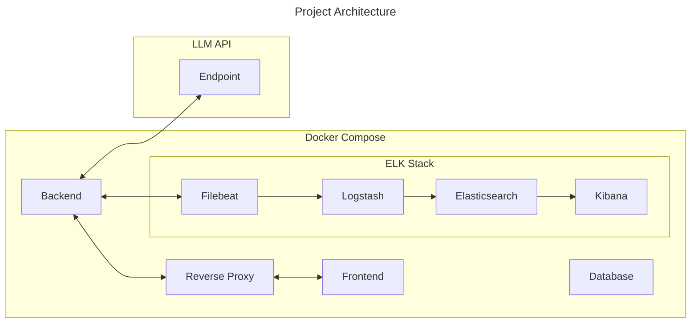

# Project Architecture

```mermaid
---
title: Project Architecture
theme: base
---

flowchart LR
    subgraph docker[Docker Compose]
        backend[Backend]
        frontend[Frontend]
        database[Database]
        nginx[Reverse Proxy]
        subgraph elk[ELK Stack]
            elastic[Elasticsearch]
            kibana[Kibana]
            logstash[Logstash]
            filebeat[Filebeat]
        end
    end

    subgraph llmapi[LLM API]
        llmendpoint[Endpoint]
    end

        backend <--> filebeat
        backend <--> nginx
        backend <--> llmendpoint
        nginx <--> frontend
        filebeat --> logstash
        logstash --> elastic
        elastic --> kibana
```
